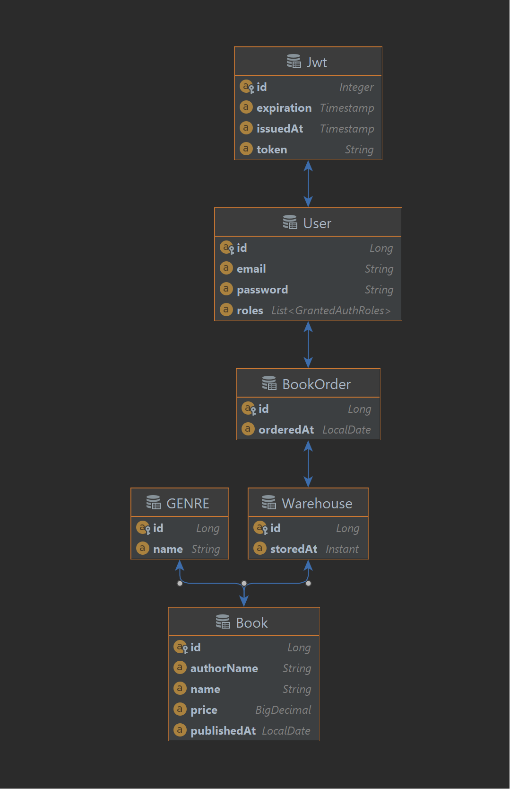

# ReadingIsGood
Documentation for ReadingIsGood application.

## Tech Stack
Project use Spring Boot and H2 Database.Project runtime is java 11.

## Design
Project design based on Controller-Service-Repository pattern. In addition DTO pattern used for abstract Business Relation Models to Clients. Project structured as follows; 

* **component**: Holds Helpers and DTO mappers objects.
* **config**: Holds Spring configuration classes which configure security, web and global exception handlers.
* **controller**: Holds request handler controllers for process incoming calls from Clients.
* **misc**: Holds DBPrePopulator class that fill database with mock data in order to use in demo purposes.
* **model**: Holds Relational and DTO models which provide process Business data.
* **repository**: Holds ORM abstraction layer between app runtime and database.
* **service**: Holds Service classes that implement of Business logic.
* **test/integration**: Holds integration tests for validate app functionality with mock data.

### Relational Model Diagram

### Application Logic
Application process request that provide functionality required by Business Logic. Every request follow below steps:

1. Request guide to appropriate REST endpoint in controller package via Spring Boot Web.
2. Request payload validate and deserialize as DTO model argument for controller method. If endpoint require Client authorization control, Request Authorization header JWT token used.
3. Controllers use appropriate service package class and methods to handle Business logic.
4. Services use appropriate repository package class and methods to process request as transaction with defined Business Relation Models in database.
5. Finally, controller return response as DTO model to Client.

###Remarks
* **Validations**: Every request validated with javax validation system. Validation done through using javax annotation in DTO model fields.
* **Authentication**: Endpoint authentication done through **config/security** package. In this package I added Spring Web Configuration that check Authorization header JWT with using spring **RequestFilter**. User passwords stored in database with BCrypt algorithm to prevent password leak when database breach.
* **Responses**: DTO models inherit from BaseRespDTO model to provide same response structure for every REST controller endpoints.
* **Postman**: Sample Postman requests added in **src/main/resources** as **api.postman_collection.json** and **auth-user.postman_collection.json**.
* Spring JPA transaction isolation system use for to prevent race-condition between Client requests. (e.g. for new Order requests)

###Assumptions
* Controller endpoints also have role based authentication. However, these feature disabled due Demo App not have administration features.
* _Order feature_ immediately process transaction. However, _add to basket_ feature could be added provide further application usage.

## Prerequisites
In order run project:

* **Apache Maven 3.6.2** and **JDK 11** must be installed. 
* **Docker 20.10.12** could be use for containerization.

## How To Use
Project could be started with 2 options:

* Standalone: Run command `mvn spring-boot:run` in project root folder.
* Container: Run command `mvn spring-boot:build-image` in project root folder. Then run command `docker run -p 8080:8080 readingisgood` command to bootstrap docker container.
* Integration Test: Run command `mvn test` to test application against predefined scenarios in **src/test**. 

After Standalone or Container commands run database prepopulated with sample data. Sample data can be queried from `http://localhost:8080/h2-console` using credentials in Application system out line starting `H2 console available at`. Database not have password can be login directly using **h2-console** page connect button.

Sample Postman requests in **src/main/resources** could be used to try Application Endpoints. Request features:

* **auth/user/customer/register**: Register new customer Client.
* **auth/user/customer/login**: Login existing customer Client.
* **auth/user/customer/logout**: Logout existing customer Client.\
**Note** Before using Demo App register and login new customer user\
\--------------------------
* **api/book/save**: Add new book.
* **api/book/addStock**: Add new book stock.
* **api/book/getAll**: Get all book.
* **api/book/getAllBookStock**: Get all book stock.\
\--------------------------
* **api/order/new**: Order new books.
* **api/order/get**: Get book order by id.
* **api/order/getWithInterval**: Get book orders between start and end intervals.\
\--------------------------
* **api/statistics/monthlyOrder**: Return monthly order statistics.\
**Note** For simplification endpoint not add year information\
\--------------------------
* **api/customer/getOrders**: Return customer specific orders.